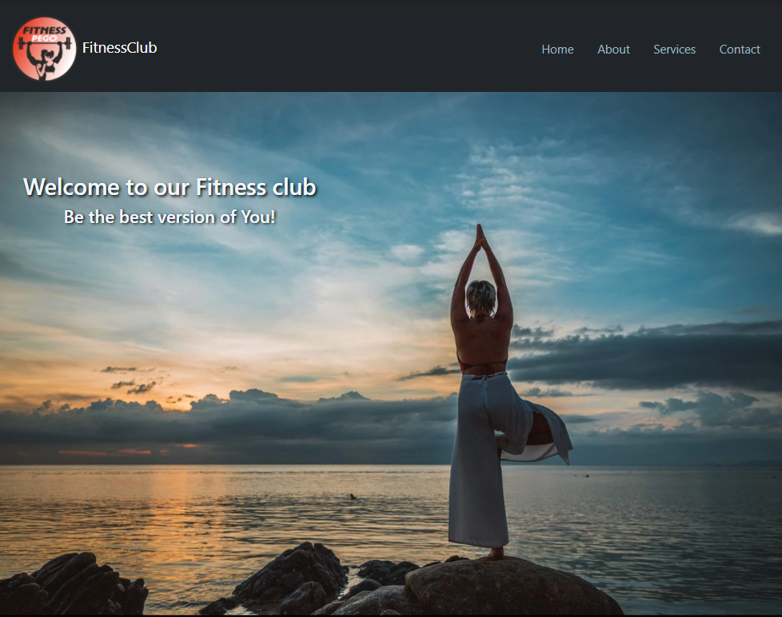
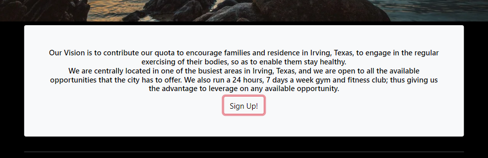
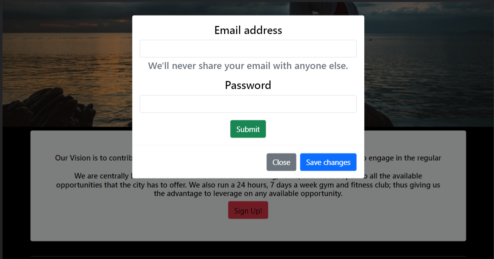
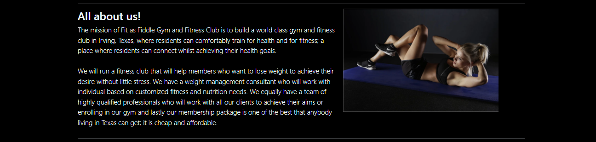
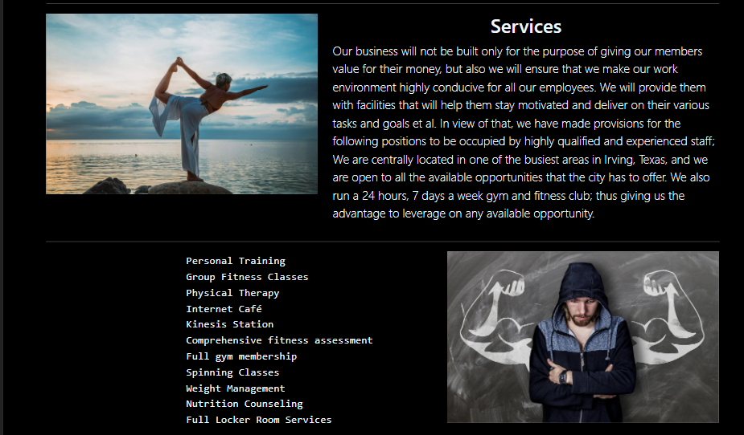
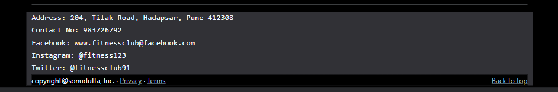

# FitnessClub-Website

## Overview
#### The website is fully-responsive on different devices!

### Home-Page

##### The home page consists of navbar and background image with a quote. 

### SignUp-Section

##### On clicking the sign-up button, sign-up modal pops up! 

### About-Section
##### It provides detail of the fitness-club.

### Services-Section
##### It provides all the services available in the fitness-club.

### Footer
##### Footer has details and location of the fitness-club and there's also a link for bringing you back to home-page.

## My process

### Built with

- Visual Studio Code
- Semantic HTML5 markup
- CSS custom properties
- Bootstrap
- Mobile-first workflow
- [React](https://reactjs.org/) - JS library
- [Next.js](https://nextjs.org/) - React framework

## Author

- Linkedin - [Sonu-Dutta](https://www.linkedin.com/in/sonu-dutta-6900b3218)
- Twitter - [@sonudutta9999](https://mobile.twitter.com/sonudutta9999)

